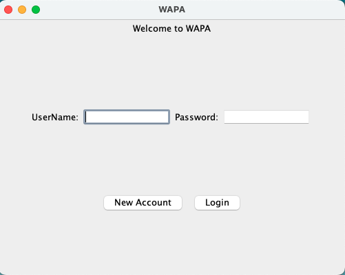
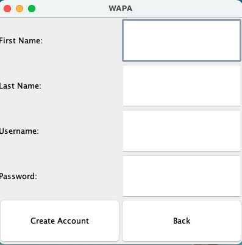
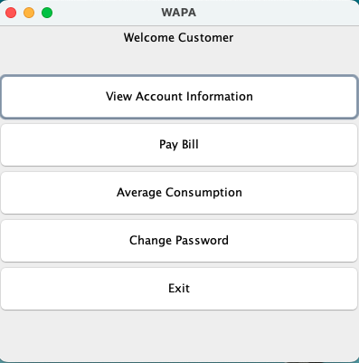
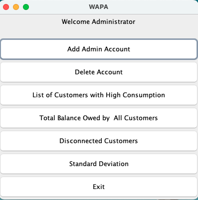
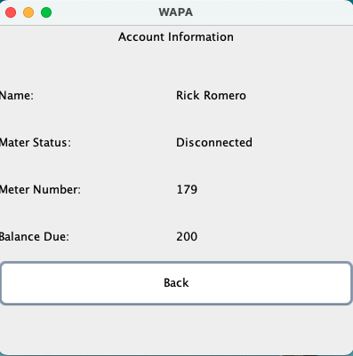
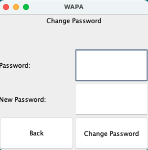
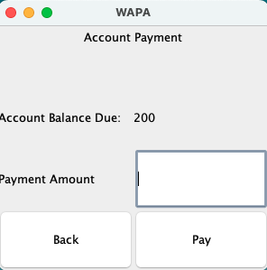
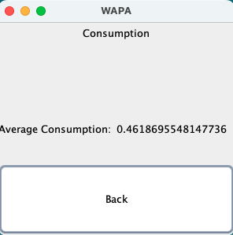

# GUI Java Desktop Application

## The following application is an adaptation implementation of a desktop app for my local power supplier company WAPA (Water And Power Authority) and was created for educational purposes 

The application uses Java framework spring to provide a Graphical User Interface experience, this was the first app I ever created during college and was used for a project.

I had limited knowledge back in the day and no access to database technologies, I had limted knowledge of database tools.

## The Problem: I wanted to save data and use that data to create User accounts and Login, while the changes are made in real time, without knowledge of a database

## The Solution: I created my own personal database with the use of Binary and Txt Files.
When creating an account I would write to a User txt file then I would implement a scanner to create the account based on data on each line, each line represents an account.
Then I would create a binary file off that data and store inside a folder called database, the database folder would contain numerous accounts, starting from 0 to however many accounts there is with the .dat file extension.
This allowed me to serialize objects into binary files and read but also update the objects into the binary files I am using, this resulted in realtime updates of accounts and data being saved whereas even if the application is closed when I return to it all the changed data remained.
Please feel free to test it yourself, one feature that shines with this method was the change password page, which would update the password in the text file as well as in the binary file. 

## Final Comments
The program uses an object-oriented programming approach and is a skeleton app in which more features can be implemented, it also comes with an admin side functionalities that pave the path to more updates in the future, allowing open source contributions. 

# Graphics

### Login

### Create Account

### Customer Home

### Admin Home

### Customer Account Info

### Customer Change Password

### Customer Account Payment

### Customer Consumption

